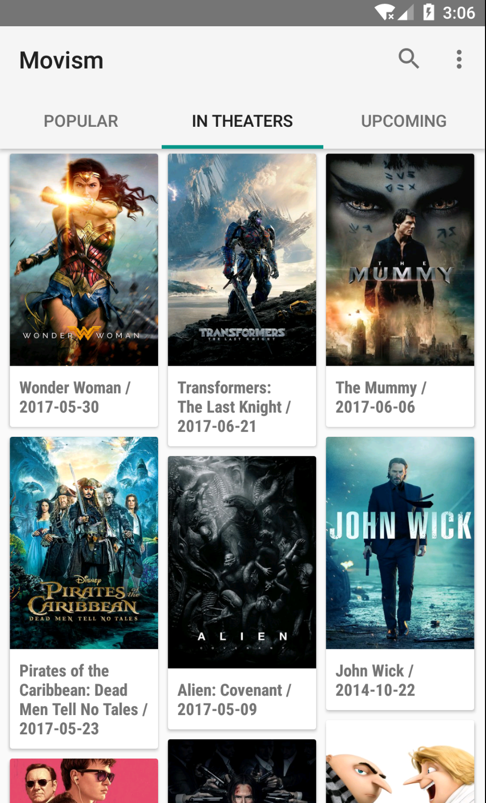
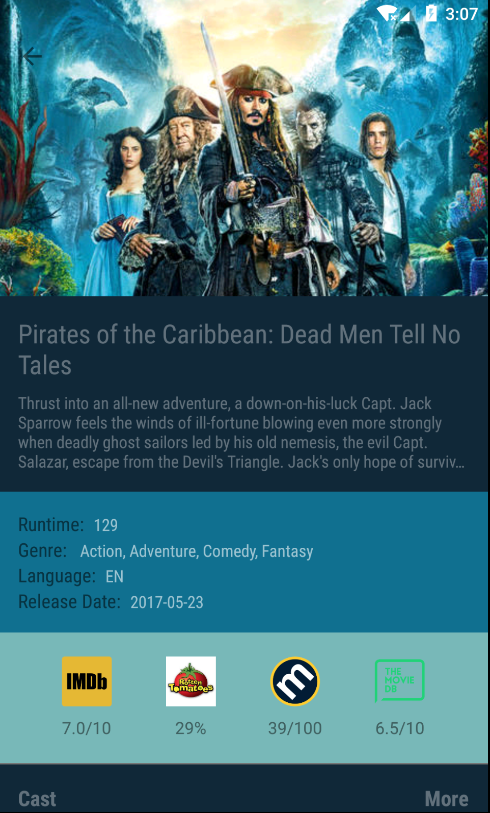
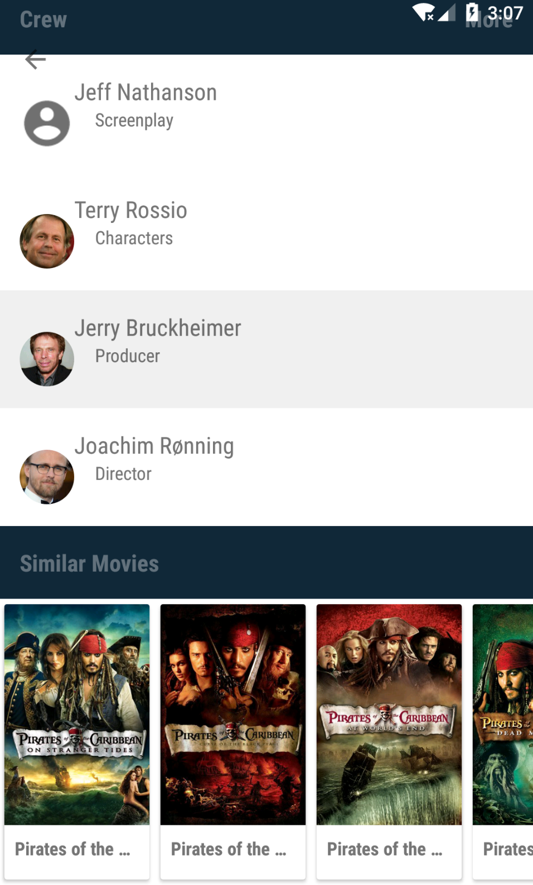
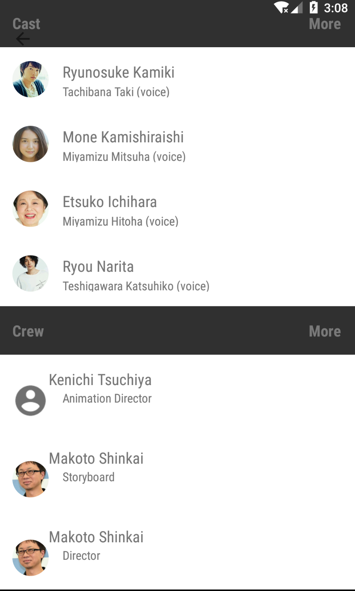
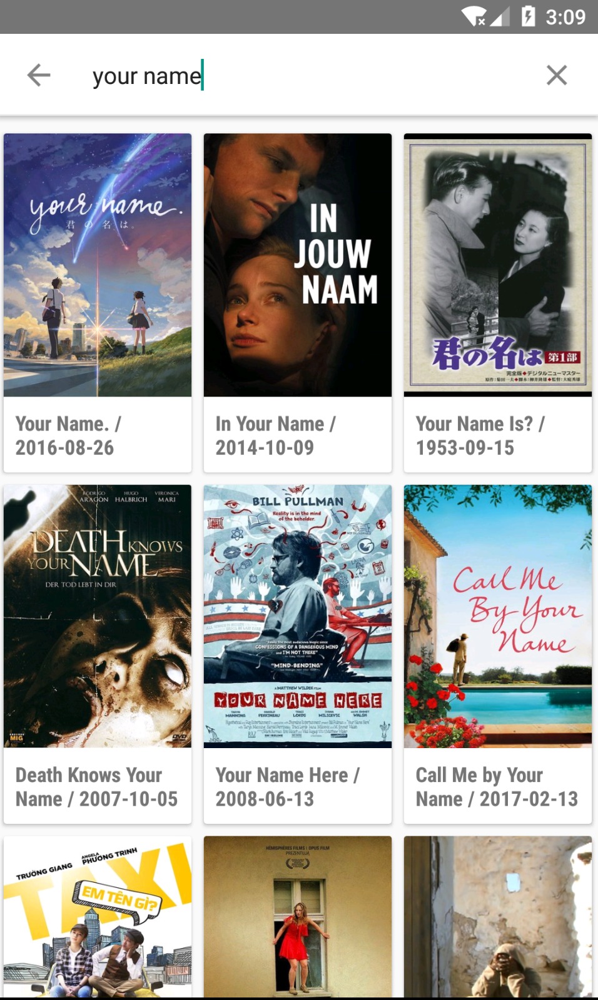
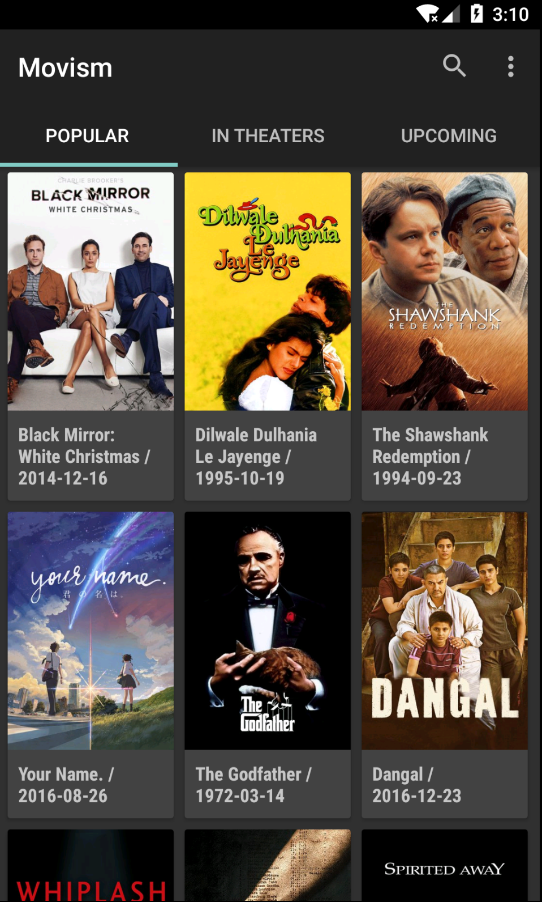
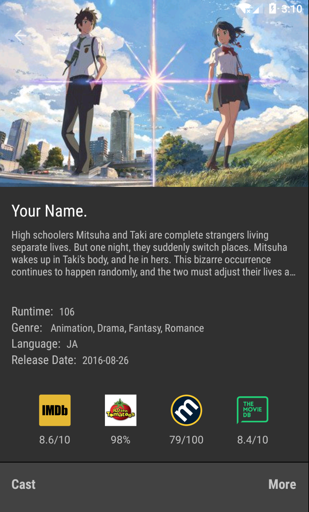
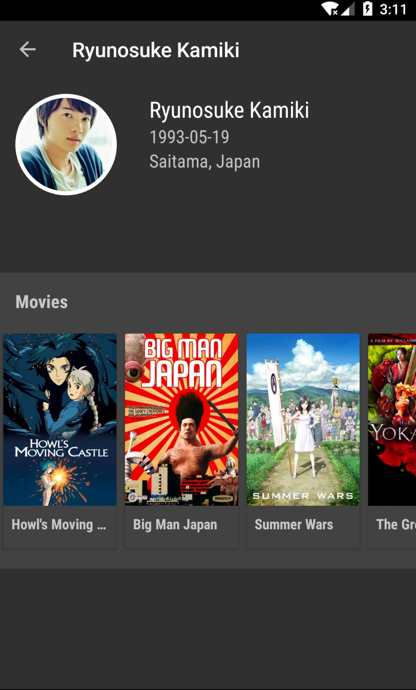
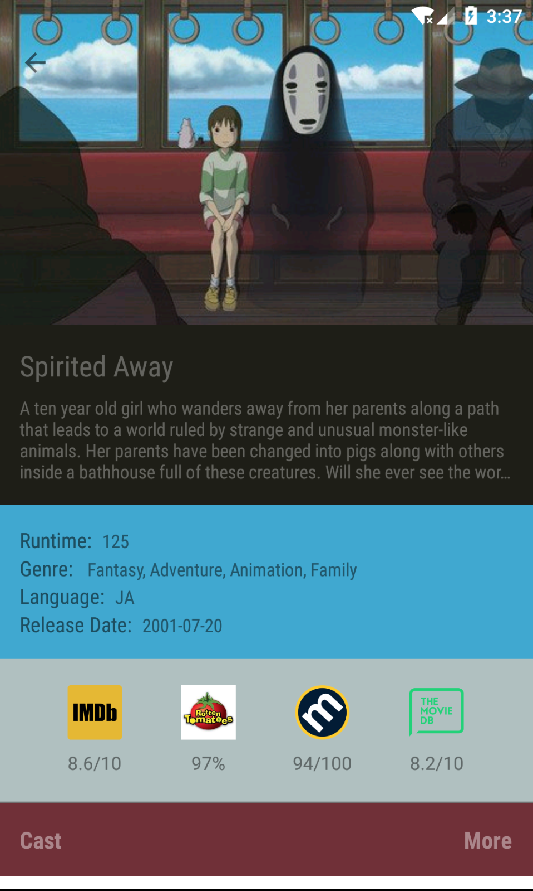

# Movism

A Material Designed Movie App based on MVP + Retrofit + RxJava

### About

This App is mainly built for learning and practice, any contributions are very welcomed !

Based on MVP architectural pattern, this app is organized in clear
 structure. With the help of Dependency Injection, every presenter has the reference of
 its view(activity and fragment) and vise versa. Also DI is used for the
 Internet Service, SharePreference, ToastUtil and so on. This helps each part of the application decouple
 from  the others, which improve the extensibility and  maintainability.
 For more information, please refer to the source code.

### Demo App


-  You can check it out already compiled at
[Google Play](https://play.google.com/store/apps/details?id=me.chenyongrui.movism)
- You can clone the project and compile it yourself, however you need to
 provide your own API keys in your local machine


## Thanks

- MVP Design Pattern
- [RxJava](https://github.com/ReactiveX/RxJava) for Async Networking
- [Dagger2](https://github.com/google/dagger) for DI
- [Retrofit](https://github.com/square/retrofit) for Restful
- [OkHttp](https://github.com/square/okhttp) for HTTP Client
- [Butter Knife](https://github.com/JakeWharton/butterknife) for View Binding
- [Glide](https://github.com/bumptech/glide) for images
- Powered by the [TMDb](https://www.themoviedb.org) and [OMDb](http://www.omdbapi.com)
- UI mainly take example by [Filmy](https://github.com/salRoid/Filmy), but different layout setting
- Material Design Library from [Google](https://developer.android.google.cn/index.html)

## Screens











## License

```
Copyright 2017-present Yongrui Chen

Licensed under the Apache License, Version 2.0 (the "License");
you may not use this file except in compliance with the License.
You may obtain a copy of the License at

   http://www.apache.org/licenses/LICENSE-2.0

Unless required by applicable law or agreed to in writing, software
distributed under the License is distributed on an "AS IS" BASIS,
WITHOUT WARRANTIES OR CONDITIONS OF ANY KIND, either express or implied.
See the License for the specific language governing permissions and
limitations under the License.
```
