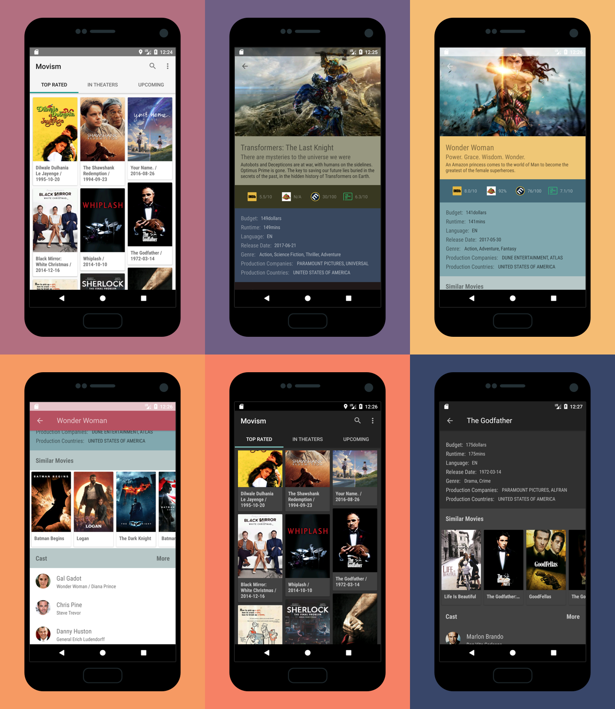

# Movism

A Material Designed Movie App based on MVP + Dagger2 + RxJava + Retrofit

Powered by [TMDb](https://www.themoviedb.org) and [OMDb](http://www.omdbapi.com)


## About

This demo is built for design pattern and tech stack practice, any contributions are  welcomed !


### Main Features

- Material Design UI + Day/Night Theme Switch
- Beautiful dynamic color theme based on movie posters
- Go through Movies in various categories, search movie by title
- Review Movie detail, cast, crew,  rating from major movie websites like IMDB, Popcorn Times
- Similar Movie Recommendation(provided by TMDb)

### Software Architecture
- Based on MVP pattern, Every View(Activity/Fragment) has its presenter, which is defined in the Contract interface.
- Use Dagger2 to inject everything: view, presenter, service, repository, even adapter!
- Create a generic adapter, remain only one adapter, every layout define and bind in the ViewHolder, therefore cut out a lot of redundant codes.
- Utilize Retrofit make HTTP request to REST API and handle responses through RxJava Data Stream in a pretty flexible way.
- Read codes to know more !


### Demo App


-  You can check it out directly at
[Google Play](https://play.google.com/store/apps/details?id=me.chenyongrui.movism)
- Or You can clone the project and compile it yourself, however you need to
 provide your own TMDb/OMDb API keys in your local machine(refer to the gradle function in the app folder)


## Thanks

- [RxJava](https://github.com/ReactiveX/RxJava) for Async Networking
- [Dagger2](https://github.com/google/dagger) for DI
- [Retrofit](https://github.com/square/retrofit) for Restful
- [OkHttp](https://github.com/square/okhttp) for HTTP Client
- [Butter Knife](https://github.com/JakeWharton/butterknife) for View Binding
- [Glide](https://github.com/bumptech/glide) for images
- [SuperRecyclerView](https://github.com/Malinskiy/SuperRecyclerView) for Refresh and Pull Load More


## Screens
<br/>



## License

```
Copyright 2017-present Yongrui Chen

Licensed under the Apache License, Version 2.0 (the "License");
you may not use this file except in compliance with the License.
You may obtain a copy of the License at

   http://www.apache.org/licenses/LICENSE-2.0

Unless required by applicable law or agreed to in writing, software
distributed under the License is distributed on an "AS IS" BASIS,
WITHOUT WARRANTIES OR CONDITIONS OF ANY KIND, either express or implied.
See the License for the specific language governing permissions and
limitations under the License.
```
