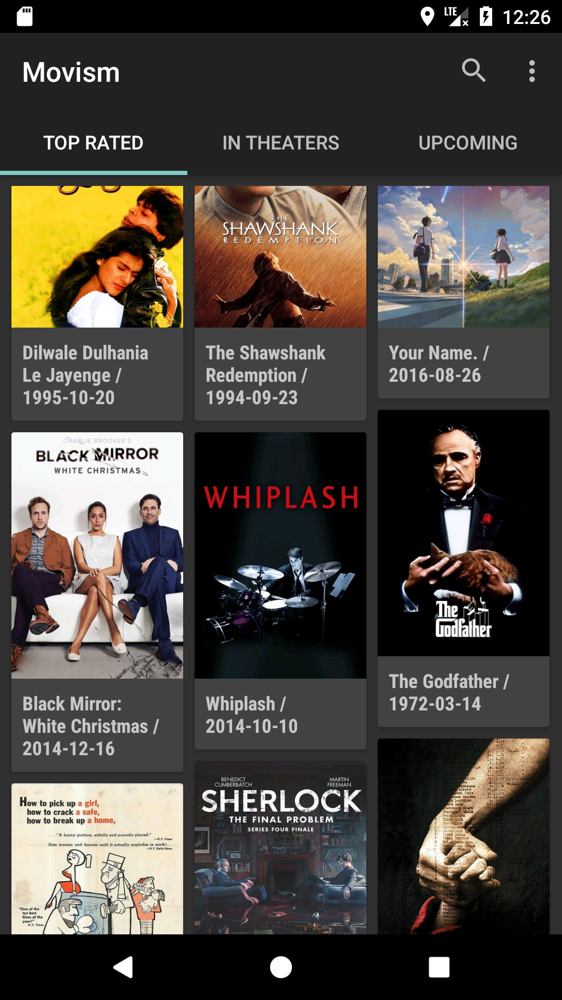
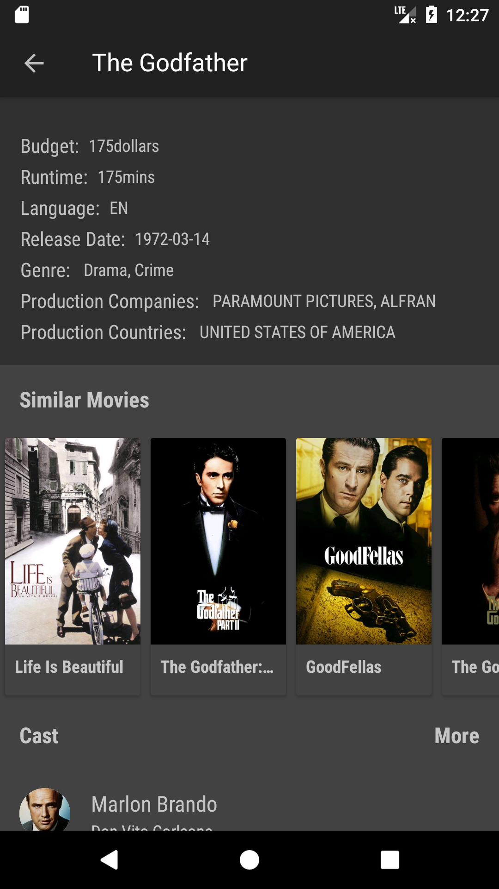

# Movism

A Material Designed Movie App

based on MVP + Dagger2 + Retrofit + RxJava + OmniAdapter(by myself)


## About

This App is mainly built for learning and practice, any contributions are very welcomed !

### Main Features
- Material Design UI +  Day/Night Theme Switch
- Beautiful dynamic color theme based on movie posters
- Go through Movies in various categories, search movie by title
- Review Movie details, cast, crew,  rating from major movie websites like IMDB
- Similar Movie Recommendation


### Demo App


-  You can check it out already compiled at
[Google Play](https://play.google.com/store/apps/details?id=me.chenyongrui.movism)
- You can clone the project and compile it yourself, however you need to
 provide your own API keys in your local machine


## Thanks

- MVP Design Pattern
- [RxJava](https://github.com/ReactiveX/RxJava) for Async Networking
- [Dagger2](https://github.com/google/dagger) for DI
- [Retrofit](https://github.com/square/retrofit) for Restful
- [OkHttp](https://github.com/square/okhttp) for HTTP Client
- [Butter Knife](https://github.com/JakeWharton/butterknife) for View Binding
- [Glide](https://github.com/bumptech/glide) for images
- [SuperRecyclerView](https://github.com/Malinskiy/SuperRecyclerView) for Refresh and Pull Load More
- Powered by the [TMDb](https://www.themoviedb.org) and [OMDb](http://www.omdbapi.com)
- Material Design Library from [Google](https://developer.android.google.cn/index.html)

## Screens






## License

```
Copyright 2017-present Yongrui Chen

Licensed under the Apache License, Version 2.0 (the "License");
you may not use this file except in compliance with the License.
You may obtain a copy of the License at

   http://www.apache.org/licenses/LICENSE-2.0

Unless required by applicable law or agreed to in writing, software
distributed under the License is distributed on an "AS IS" BASIS,
WITHOUT WARRANTIES OR CONDITIONS OF ANY KIND, either express or implied.
See the License for the specific language governing permissions and
limitations under the License.
```
